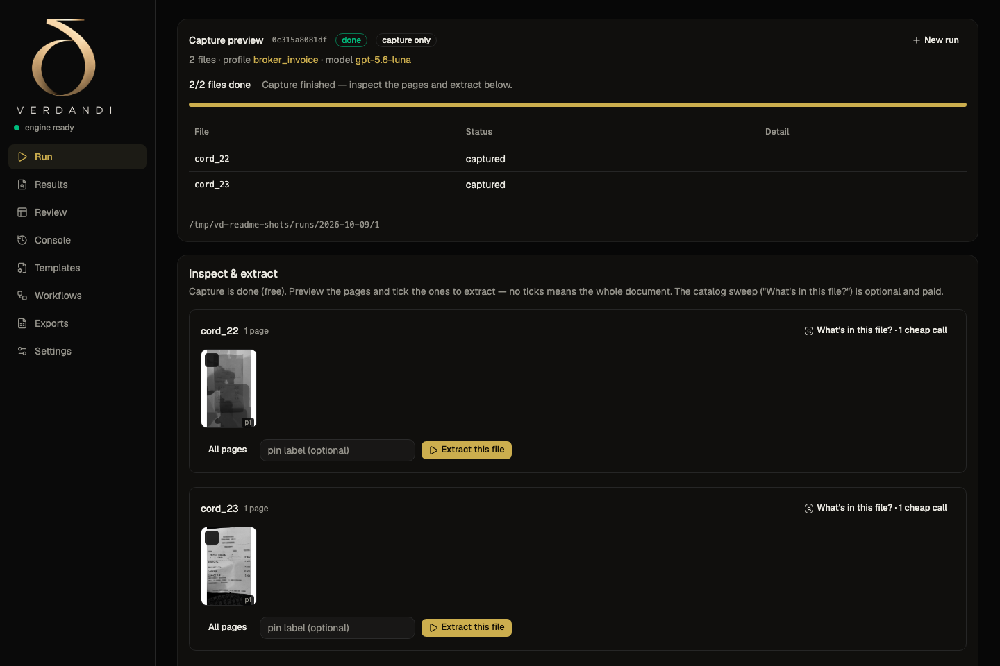
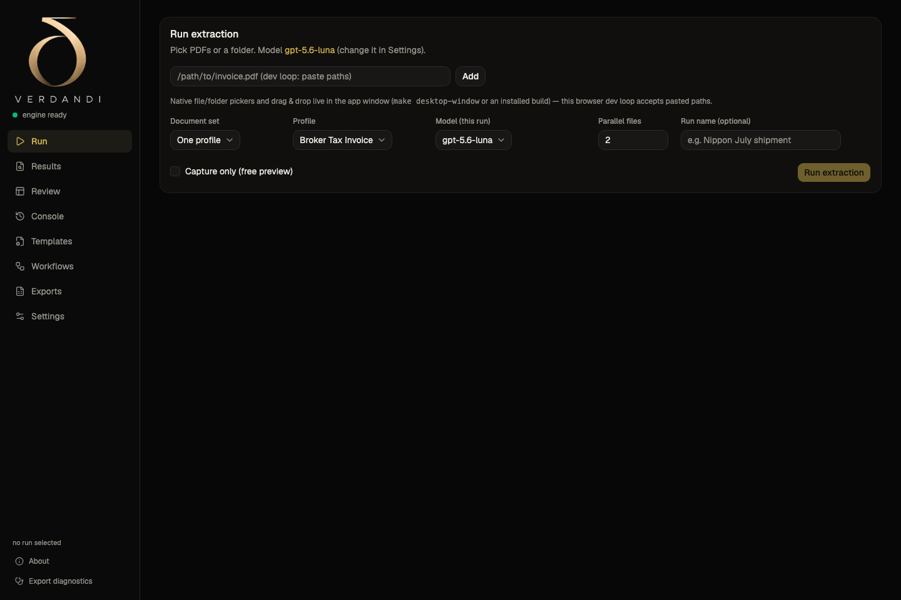
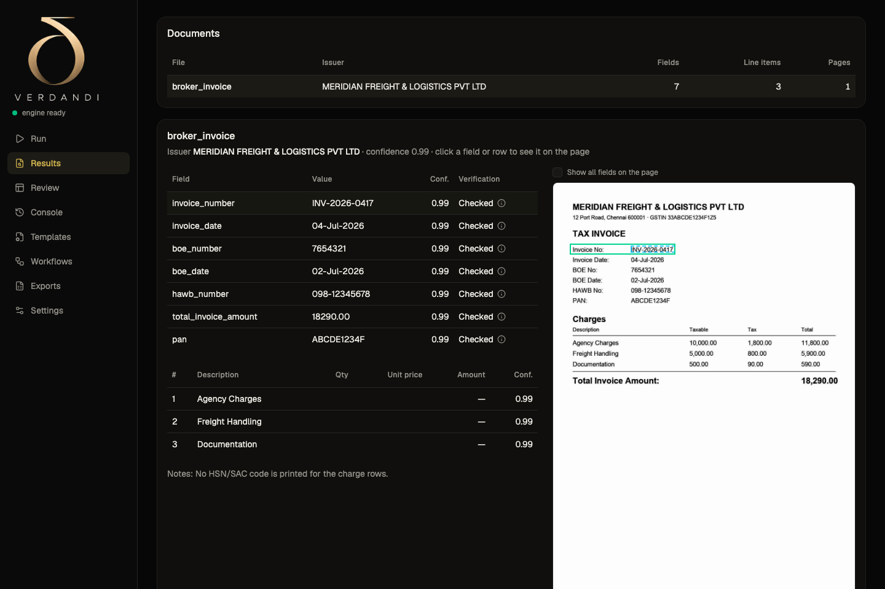
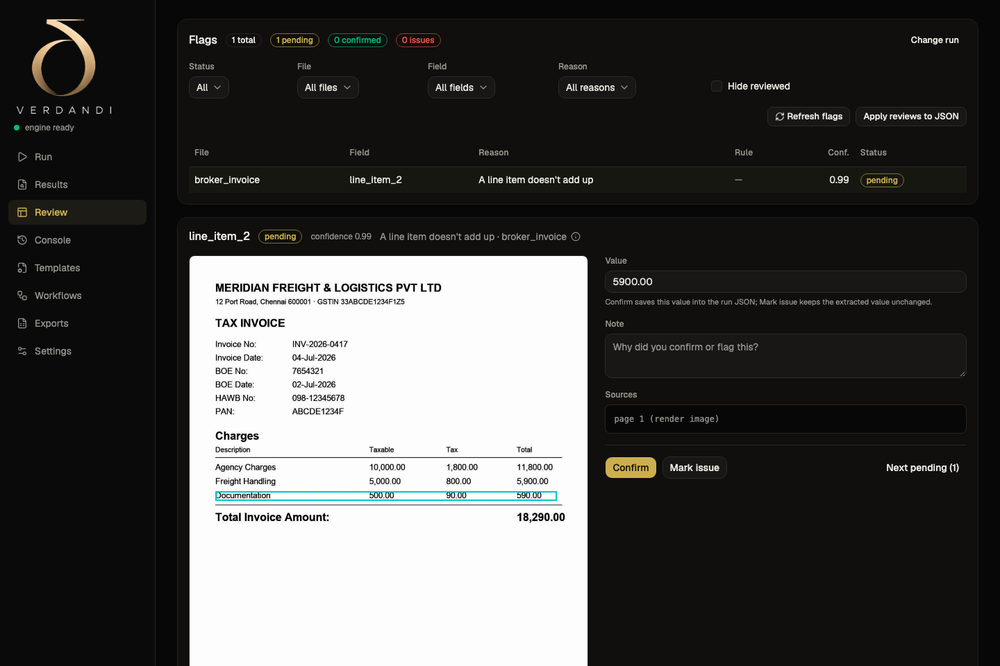
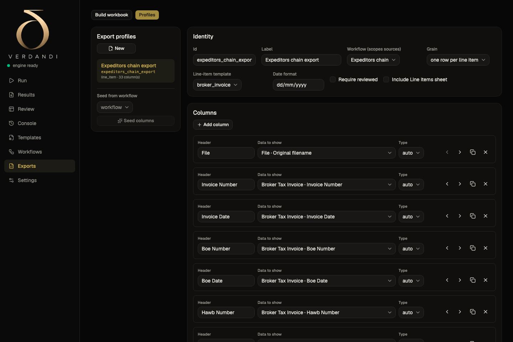
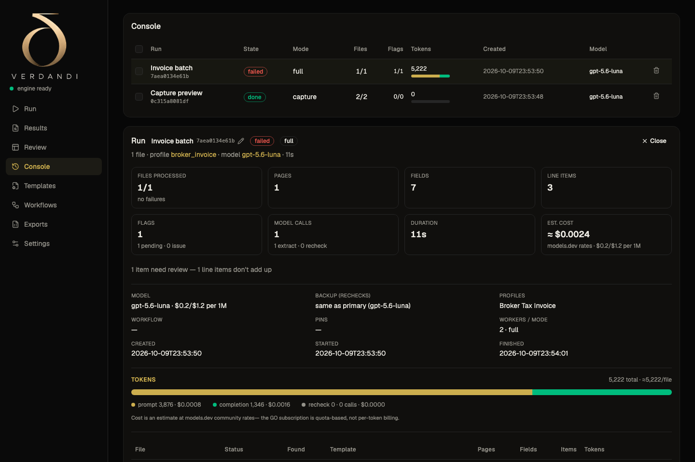

# Verdandi

**Verdandi reads documents and turns them into verified, structured data.**
Point it at PDFs — broker tax invoices, bills of entry, air waybills,
commercial invoices, receipts, or any other document — and it captures the
pages, reads them with a vision AI model, checks every value locally, and
exports a clean Excel workbook with anything doubtful flagged for review.

It is a native desktop app for macOS and Windows. Your documents stay on your
machine; the only thing sent to the cloud is the page image of the document
being read, through the AI provider **you** configure with **your own key**.

[**Download the latest release →**](../../releases/latest)

## What it does

### Reads any document with vision AI
One paid model call per document. Vision-primary means no brittle template
matching: the model sees the page and reports what is printed. Verdandi ships
with starter templates for freight documents — broker tax invoice, bill of
entry, air waybill, commercial invoice — and you can build your own in the
app.

### Capture is free — spend only when you extract
Rendering, OCR and orientation handling are local and free. Preview every
page, tick the ones that matter, pin them, and only then run extraction.
Bulk runs capture first and extract when you are ready.

### Every value is verified locally
A deterministic stack checks the model's own output: grounding (is the value
actually printed in this file's text?), arithmetic (do the table's numbers
add up?), formats, and an independent re-read of doubtful values. Anything
that cannot be confirmed becomes a review flag — Verdandi never silently
guesses.

### Review with evidence, not blind trust
Every flag shows the crop of the page and the located text, so you can
confirm or correct in seconds. Corrections flow straight into the export.

### Cross-document checks
When one file contains several documents, workflows can assert that they
agree — for example, the bill-of-entry number on the invoice must match the
attached bill of entry. Broken chains are flagged on both sides.

### Excel exports that explain themselves
Typed columns (numbers as numbers, dates as dates), colour-coded review
state (amber = needs review, red = issue/mismatch, grey = couldn't check),
an Issues sheet listing every flag, and a Meta sheet with provenance.

### Built for volume
Multi-document PDFs, multi-template runs, workflow bundles, parallel
workers, resumable batches, per-run token and cost estimates, logs and
storage cleanup in the Console.

## Requirements

- **macOS 10.15+ (Apple Silicon)** or **Windows 10+ (x64)**
- Your own **opencode Zen gateway key** — get one at
  [opencode.ai/auth](https://opencode.ai/auth). It is stored in your
  operating system's keychain, never in a file.
- Internet connection for extraction. Capture, review and export work
  offline.
- Nothing else to install: the OCR engine is bundled (Xcode is not
  required).

## Install

### macOS

1. Download `Verdandi_<version>_aarch64.dmg` from the
   [latest release](../../releases/latest).
2. Open it and drag **Verdandi** to **Applications**.
3. The app is ad-hoc signed (not notarized), so macOS asks for a one-time
   approval: open the app once, then go to **System Settings → Privacy &
   Security**, scroll to the Security section and click **Open Anyway** next
   to Verdandi.
4. If that button isn't offered, run this in Terminal instead:
   `xattr -cr /Applications/Verdandi.app`

### Windows

1. Download `Verdandi_<version>_x64-setup.exe` (or the `.msi` for managed
   installs) from the [latest release](../../releases/latest).
2. Run it. The installer is unsigned, so SmartScreen shows *"Windows
   protected your PC"* — click **More info** → **Run anyway**.
3. Microsoft Edge WebView2 is downloaded automatically if it is missing.

## First run

1. **Paste your gateway key** (from
   [opencode.ai/auth](https://opencode.ai/auth)). It goes into the OS
   keychain. "Test key" runs one tiny paid probe if you want to confirm it.
2. **Read the privacy step** — it explains exactly what leaves the machine.
3. **Optionally leave your details** so we can follow up on feedback
   (skippable; editable later in About).
4. **Pick a model** — only models verified for vision are offered; the
   default is a good, inexpensive choice.

## Running a document

1. **Run tab** — choose files or a folder, or drag PDFs onto the window.

   

2. Pick a **template** (one profile), **several profiles**, or a
   **workflow bundle** for files that contain multiple documents.
3. Optional: tick **Capture only (free preview)**, inspect the pages and
   extract exactly what you need. Leave it unticked to capture and extract
   in one go.
4. **Results** — fields and line items with confidence; click any row to see
   where it sits on the page (the located box and the model's claim).

   

5. **Review** — work through the flags with the evidence pane; confirm or
   correct each one. "Apply all reviews to JSON" writes your decisions into
   the run.

   

6. **Exports** — build the workbook with a saved export profile (or create
   one in the same screen) and download it.

   

7. **Console** — every run with its files, flags, tokens, cost estimate and
   worker log. Free up space by pruning page renders; delete runs you no
   longer need.

   

## What it costs

- **The app is free.** You pay your AI provider directly, with your own key.
- **One paid model call per document** for extraction, plus optional paid
  actions you explicitly confirm: a page catalog sweep, the key test, and
  small re-checks of doubtful values.
- Capture, OCR, orientation, verification, review and export are **local and
  free**.
- Typical cost is a fraction of a cent to a few cents per document depending
  on the model and page count — the app shows the estimated cost and the
  exact token usage for every run.

## Accuracy

On an internal 100-document benchmark (October 2026 — freight invoices,
receipts and scanned documents, identical PDFs for every system):
**97.0% field accuracy** versus **96.2% for Azure Content Understanding**,
with line-item F1 0.958 vs 0.893, at roughly **one tenth of the cost**.

## Privacy and security

- **Your documents stay on your machine.** The only thing sent to the cloud
  is the page image of the document being read, to the provider you
  configured.
- Runs, crops, reviews and exports live in your workspace folder
  (`~/.verdandi`; `%USERPROFILE%\.verdandi` on Windows).
- Your gateway key is stored in the operating system's keychain.
- The app periodically checks a small access list (an anonymous install ID,
  the app version and your OS — never documents).
- Full details: [Privacy Policy](PRIVACY.md) · [License](EULA.md).

## Updates, data, uninstall

- **Updates:** the app checks quietly on launch and offers new versions in
  Settings; updates install in place.
- **Where data lives:** `~/.verdandi` (macOS) or `%USERPROFILE%\.verdandi`
  (Windows) — settings, templates, runs and exports.
- **Uninstall:** delete the app and delete that folder to remove all data.

## Troubleshooting

| Symptom | Fix |
|---|---|
| macOS: *"cannot verify…"* on first open | System Settings → Privacy & Security → **Open Anyway**, or `xattr -cr /Applications/Verdandi.app` |
| Windows: *"Windows protected your PC"* | **More info** → **Run anyway** |
| "Engine offline" in the sidebar | Restart the app; the log at `~/.verdandi/logs/shell.log` records what happened. Still stuck? Email us. |
| "Gateway key was rejected" | Re-check the key in Settings (it must be an opencode Zen key). |
| A page image is missing after cleanup | Page renders were pruned to save space — re-capture the file (free). |

## Feedback and support

- In the app: **About → Send feedback** (and **Your details** to stay in
  touch).
- Email: **akshaymsingh.work@gmail.com**

## License

Proprietary — see the [End User License Agreement](EULA.md).
